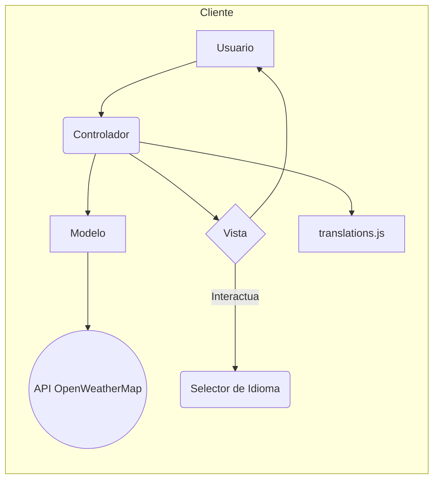

```mermaid
graph LR
    subgraph Cliente
        A[Usuario] --> B(Controlador);
        B --> C{Vista};
        B --> D[Modelo];
        B --> F[translations.js];
        D --> E((API OpenWeatherMap));
        C --> A;
        C --Interactua--> G(Selector de Idioma);

    end
```
